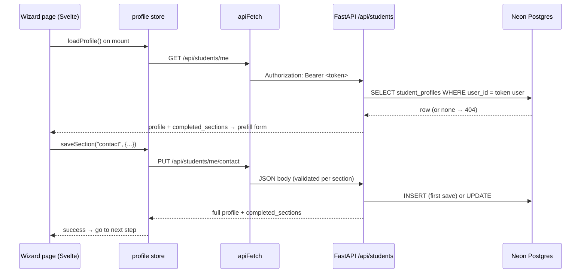

# Application Profile → Neon: Walkthrough

This document explains how the six-step **application profile** wizard
(`/application/*`) was connected to the Neon Postgres database, and why each
changed file changed. It accompanies PR #45.

---

## 1. The problem we started with

Before this change, the wizard only *looked* like it saved data:

- Each page `POST`ed to `/api/v1/student-profile`, an endpoint that does not
  exist on the backend.
- Whether the request succeeded or failed, the page wrote
  `localStorage.section_<name>_complete = "true"` and showed "✓ saved".
- Nothing reached the database. Answers were lost on another browser/device,
  and the sidebar badges and dashboard progress only reflected localStorage.
- The `student_profiles` table only had `full_name`, `phone`,
  `education_summary` and `writing_sample`, so there was nowhere to store most
  of the form anyway. `full_name` was also `NOT NULL`, so a profile could not
  be created unless step 1 came first.

## 2. How it works now



Key ideas:

1. **One endpoint per wizard step.** `PUT /api/students/me/{section}` where
   `section` is `profile`, `contact`, `education`, `testing`, `activities` or
   `writing`. Each has its own strict Pydantic schema.
2. **Upsert.** The first save of *any* step creates the row, and later saves update it.
   Steps can be filled in any order.
3. **Ownership comes from the JWT, never the body.** The backend uses
   `current_user.id` from the token. Sending `user_id` in the body is rejected
   (`extra="forbid"` → 422).
4. **The server decides what is complete.** The response includes
   `completed_sections`, a step is complete when all its required fields are
   stored. The sidebar badges and dashboard read this instead of localStorage.
5. **Pages only move forward on success.** Validation errors from the backend are
   shown to the user (e.g. `phone: Enter a valid phone number, e.g. +237 6XX XX XX XX`).

### API

| Method | Path | Purpose |
|--------|------|---------|
| `GET` | `/api/students/me` | Full profile incl. `completed_sections` (404 until first save) |
| `PUT` | `/api/students/me/{section}` | Save one wizard step |

Fields per step (required unless marked optional):

| Section | Fields |
|---------|--------|
| `profile` | `first_name`, `last_name`, `email`, `phone`, `declared_state` (Cameroon region) |
| `contact` | `address`, `city`, `region` (Cameroon region), `emergency_contact_name`, `emergency_contact_phone` |
| `education` | `secondary_school`, `o_level_slip_url`, `a_level_slip_url` |
| `testing` | `o_level_passes`, `a_level_points`, `english_test_type` *(optional: IELTS/TOEFL/Duolingo/GCE_English)*, `english_test_score` *(optional)* |
| `activities` | `activity_name`, `activity_role`, `activity_description`, `honors_awards` *(optional)* |
| `writing` | `essay_prompt` (one of the 4 prompts), `writing_sample`, `additional_info` *(optional)* |

Blank optional fields are stored as `NULL`, not `""`.

---

## 3. Backend changes (`backend/`)

### `alembic/versions/c467286e6e24_add_application_profile_sections_to_.py` *(new)*
The database migration. It is **additive only**:
- Adds the 22 wizard columns to `student_profiles`, plus `updated_at`.
- Makes `full_name` nullable so any step can be saved first.
- The downgrade reverses this. It fills `NULL` `full_name` values with `''`
  before restoring `NOT NULL`, so it cannot fail on existing rows.

`alembic revision --autogenerate` also picked up unrelated drift in the
production database (index names `idx_*` vs `ix_*`, a leftover
`playing_with_neon` table). That was **deliberately removed** from this
migration to keep it safe. So `alembic check` still reports that older drift.

### `app/models/student_profile.py`
The SQLAlchemy model gets the same new columns, grouped by section with
comments. `full_name` is now nullable and `updated_at` auto-updates. Two
existing columns are reused: the profile step's `phone` goes into `phone`, and
the writing step's personal statement goes into `writing_sample`.

Test scores such as `o_level_passes` are `String`, not `Integer`, because the UI
collects free text like "9 Passes (5 A…)".

### `app/schemas/student_profile.py`
Where validation lives:
- One schema per step (`ProfileSection`, `ContactSection`, …), all with
  `extra="forbid"` so unknown or malicious fields are rejected.
- Reusable types: trimmed text with length limits, `EmailStr`, a phone
  validator, and `Literal` lists for Cameroon regions, English tests and essay
  prompts.
- `SECTION_SCHEMAS` maps the section name to its schema. `SECTION_REQUIRED_FIELDS` is
  **derived** from those schemas (fields without a default), so "what is
  required" is defined in exactly one place.
- The `StudentProfile` response model has a computed `completed_sections`
  field built from `SECTION_REQUIRED_FIELDS`.
- The phone error uses `PydanticCustomError` so the user sees a clean message
  without Pydantic's `"Value error, "` prefix.

### `app/services/student_service.py`
New `save_section(db, user_id, section, section_in)`:
- Looks up the profile by `user_id`. If there is none, it inserts one, otherwise it updates the
  fields of that step.
- For the `profile` step it also sets `full_name = first_name + " " + last_name`
  so older code that reads `full_name` keeps working.
- **Race safety:** if two first saves arrive at once (double click, two tabs),
  the unique `user_id` constraint makes one insert fail with `IntegrityError`.
  That case rolls back and updates the row that won.

### `app/routers/students.py`
A small loop over `SECTION_SCHEMAS` registers one `PUT /me/{section}` route per
step. Each route uses that step's schema, so FastAPI validates the body and the
OpenAPI docs (`/docs`) show every step separately. All routes require
`get_current_user`.

### `app/db/database.py`
`create_engine(..., pool_pre_ping=True, pool_recycle=300)`.
Neon suspends idle databases and drops their connections. Without this, the
first request after a quiet period failed with a 500 (`SSL SYSCALL error:
EOF`). `pool_pre_ping` checks a pooled connection before using it.

### `requirements.txt`
Pinned `alembic==1.20.0`. Migrations are part of deployment now, so the
version must be fixed.

### Tests: `pytest.ini`, `tests/conftest.py`, `tests/test_application_profile.py` *(new)*
- `conftest.py` sets `DATABASE_URL` to a **temporary SQLite file** before the
  app is imported, so tests never touch Neon and need no network. It gives
  every test a fresh database plus helpers to sign up and log in users.
- 16 tests cover:
  - saving requires auth
  - 404 before the first save
  - any step can be saved first
  - `full_name` derivation and in-place updates
  - saving one step keeps the others
  - all steps saved marks them all complete
  - blanks are stored as null
  - invalid payloads return 422
  - a client cannot set `user_id`
  - two accounts can't see each other's data

Run them with `cd backend && python -m pytest -q`.

---

## 4. Frontend changes (`frontend/`)

### `src/lib/config.ts`
From the teammates' `dev` work: a single `API_BASE_URL` used by every page.
While merging, it was changed to read `PUBLIC_API_BASE_URL` through
`$env/dynamic/public`. The original `import.meta.env.PUBLIC_API_BASE_URL` was
always `undefined`, because Vite only exposes `VITE_*` variables there, so
`.env` was ignored. If the variable is not set, it falls back to the Render backend.

### `src/lib/api/client.ts` *(new)*
`apiFetch()` is a small wrapper around `fetch` that every authenticated call
should use:
- Adds `Authorization: Bearer <access_token>` from localStorage.
- Prefixes `API_BASE_URL`.
- Converts FastAPI errors into readable text, e.g. 422 details become
  `phone: Enter a valid phone number…`.
- If the network fails, it throws a friendly "Cannot reach the server" message.
- On a **401** it clears the token and redirects to `/login`.

### `src/lib/api/profile.ts` *(new)*
Typed API functions: the `StudentProfile` TypeScript type that mirrors the
backend response, `fetchMyProfile()` (404 → `null`) and
`saveProfileSection(section, data)`.

### `src/lib/stores/profile.svelte.ts` *(new)*
A shared Svelte 5 `$state` store so all pages see the same profile:
- `loadProfile()` fetches once and de-duplicates concurrent calls, because the layout,
  page and dashboard all ask for it on mount.
- `saveSection()` saves and replaces the stored profile with the server's
  response, so the badges update immediately.
- `isSectionComplete(section)` reads `completed_sections`.

### The six wizard pages: `src/routes/(app)/application/{profile,contact,education,testing,activities,writing}/+page.svelte`
The same pattern on every page:
1. `onMount` → `loadProfile()` → prefill the inputs from saved values.
2. Submit → `saveSection("<section>", { snake_case fields })`.
3. On success, show "✓ saved" and `goto()` the next step. On error, show the
   message in an `.alert-error` box and stay on the page.
4. The localStorage "complete" flags, the fake success in `catch`, and the
   hardcoded URLs were all removed.

### `src/routes/(app)/application/+layout.svelte`
The sidebar badges now use `isSectionComplete()` from the store instead of
localStorage. The layout loads the profile once and shows a banner if loading
fails.

> The sidebar lists five steps. The **testing** page exists and saves, but it
> isn't linked in the sidebar or dashboard, and after saving it moves on to
> activities. That was the existing behaviour and was kept.

### `src/routes/(app)/dashboard/+page.svelte`
The "x/5 sections complete" progress now comes from the store
(`completed_sections`) instead of localStorage.

### `.env.example`
`PUBLIC_API_BASE_URL=http://localhost:8001`, the port the backend uses locally.

---

## 5. Repo-level changes

- **`.gitignore`:** the Python template's `lib/` rule was silently ignoring
  `frontend/src/lib/`, so the new `$lib` files would never have been committed.
  It now uses `/lib/` plus `!frontend/src/lib/`. Upstream `dev` made the same fix,
  and their version was kept.
- **`README.md`:** added the migration step, the port 8001 note, how to run the tests,
  the Render build command, the profile API table and how `PUBLIC_API_BASE_URL`
  works.

---

## 6. Database and deployment (Neon + Render)

- **Neon project** "ApplyCM", branch `production`, database `neondb`.
- The work was developed and tested on a separate Neon branch
  (`dev-application-profile`), a copy of production, so production was never
  touched while experimenting.
- Before migrating production, a backup branch
  `backup-before-c467286e6e24` was created. Then
  `alembic upgrade head` moved production from `0dd12cfb019b` to
  `c467286e6e24`. Existing users were unaffected.
- **Render** reads `DATABASE_URL` from its environment settings. Nothing
  database-related is hard-coded or committed. We confirmed the Render backend
  uses the production Neon database.
- **Required Render setting:** set the Build Command to
  ```bash
  pip install -r requirements.txt && alembic upgrade head
  ```
  `main.py` still calls `Base.metadata.create_all()`, which creates missing
  tables but **never adds columns**. Future schema changes only reach Neon
  through Alembic.

---

## 7. Running it locally

```bash
# backend
cd backend
python -m venv venv && source venv/bin/activate
pip install -r requirements.txt
# backend/.env: DATABASE_URL=<Neon connection string>, JWT_SECRET=<random>
alembic upgrade head
uvicorn app.main:app --reload --port 8001

# frontend (second terminal)
cd frontend
npm install
cp .env.example .env        # points the UI at http://localhost:8001
npm run dev                 # http://localhost:5173
```

Get a Neon connection string from the Neon console (Connect button) or with the
Neon CLI: `neon connection-string --branch <branch> --pooled`. Prefer a
personal Neon branch for local work. If `backend/.env` points at `production`,
everything you save is real data.

**Gotchas**
- After Neon has been idle, the first request (or backend startup) can take a
  few seconds or time out once while the database wakes up. Retry.
- `--reload` does not watch `.env`. Restart uvicorn after editing it.
- Without `frontend/.env`, the local UI talks to the Render backend.

---

## 8. How it was verified

- **Backend:** 16 pytest tests pass (SQLite, offline).
- **Frontend:** `npm run check` (svelte-check) reports 0 errors.
- **End to end:** an automated browser test (Playwright) checked, against the Neon dev branch and again against production:
  - unauthenticated users are redirected to login
  - an invalid phone number shows the friendly error
  - all six steps save
  - after a reload every field is prefilled
  - the sidebar badges and the dashboard show "5/5 sections complete"
  - no console errors
- The migration was tested down and up again on the dev branch. The test
  user created in production was deleted afterwards.

## 9. Known issues not covered here

These existed before this change and are left for follow-up PRs:
- The dashboard calls `/api/v1/dashboard/summary`, which doesn't exist (error banner).
- Applications and favorites trust a `student_id` sent by the client, so a user
  could act for someone else. They should use the token, like the profile routes.
- Signup lets the client choose its `role`.
- `JWT_SECRET` has a hard-coded development default in `config.py`.
- The `(app)` routes have no page-level login guard. Only API calls redirect on 401.
