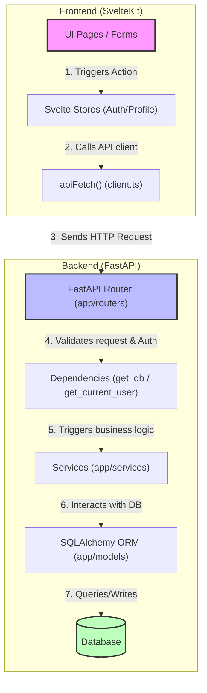
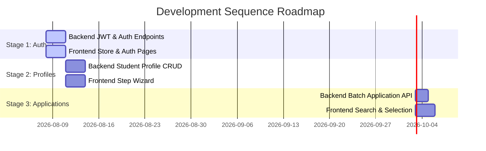

# ApplyCM Codebase Workflow & Integration Guide

This guide describes the complete workflow, directory structure, data flow, and remote collaboration practices for the **ApplyCM** platform. It is designed to help your team of four developers (2 frontend, 2 backend) work in harmony and build the codebase from the existing boilerplate.

---

## 🏗️ Architectural Overview & Request Lifecycle

ApplyCM uses a decoupled architecture where the frontend and backend communicate exclusively via JSON over HTTP.



### Trace Example: The "Apply-to-Many" Workflow
1. **User Action**: The student visits the [discover page](file:///home/dct/Desktop/Development/ApplyCM/frontend/src/routes/(app)/discover/+page.svelte), checks three university programs, and clicks **Apply to Selected**.
2. **Frontend State**: Svelte collects the selected program IDs.
3. **API Dispatch**: The [discover page](file:///home/dct/Desktop/Development/ApplyCM/frontend/src/routes/(app)/discover/+page.svelte) calls `apiFetch('/api/applications/batch', { method: 'POST', body: JSON.stringify({ student_profile_id: studentId, program_ids: [1, 2, 3] }) })`.
4. **Backend Router**: FastAPI route `apply_to_multiple_programs()` in [applications.py](file:///home/dct/Desktop/Development/ApplyCM/backend/app/routers/applications.py) receives the request. It:
   - Validates the incoming body using `BatchApplicationCreate` schema.
   - Restricts access via `get_current_user` dependency.
   - Passes the db session and validation schema to the service layer.
5. **Service Layer**: `ApplicationService.apply_to_multiple_programs()` in [application_service.py](file:///home/dct/Desktop/Development/ApplyCM/backend/app/services/application_service.py) loops through the program IDs and creates multiple `Application` entries in the database.
6. **DB Transaction**: SQLAlchemy commits the changes, and the router serializes the saved applications back to the frontend.

---

## 🐍 Backend Core Flow (`/backend`)

For the backend developers, the request flow follows a strict **layered architecture**:

### 1. Database & Schema Modeling (`app/models` & `app/schemas`)
- **SQLAlchemy Models** ([app/models](file:///home/dct/Desktop/Development/ApplyCM/backend/app/models)): Define actual database columns, types, foreign key constraints, and relationships.
- **Pydantic Schemas** ([app/schemas](file:///home/dct/Desktop/Development/ApplyCM/backend/app/schemas)): Act as serializers and validators.
  - `SchemaCreate` definitions (e.g. `UserCreate`) define fields allowed when writing to database.
  - `Schema` models (e.g. `User`) define fields serialized in API responses (with `from_attributes = True` configuration to parse SQLAlchemy objects).

> [!IMPORTANT]
> **Avoid Circular Imports in Alembic:**
> Always import `Base` from [base_class.py](file:///home/dct/Desktop/Development/ApplyCM/backend/app/db/base_class.py).
> Register models in [base.py](file:///home/dct/Desktop/Development/ApplyCM/backend/app/db/base.py) so Alembic can auto-detect structural migrations.

### 2. Business Logic & Controllers (`app/services` & `app/routers`)
- **Services** ([app/services](file:///home/dct/Desktop/Development/ApplyCM/backend/app/services)): Implement business algorithms and DB mutations here. This separates raw DB transactions from API router endpoint logic.
- **Routers** ([app/routers](file:///home/dct/Desktop/Development/ApplyCM/backend/app/routers)): Keep these routers thin. They should do nothing more than define endpoint parameters, check authentication context, call services, and return responses.

---

## ⚡ Frontend Core Flow (`/frontend`)

For the frontend developers, the application runs inside **SvelteKit** and relies on Svelte 5 runes:

### 1. State & UI Binding
- **Runes**: Use Svelte 5 state management:
  - `$state` replaces `writable` stores for local page states.
  - `$props` handles incoming parameters (such as layouts receiving their `{ children }`).
- **Layout Groups**:
  - `(auth)` contains sign-up and login logic.
  - `(app)` contains pages only accessible to authenticated users (sharing a main navigation sidebar in `+layout.svelte`).

### 2. API Access
- The [client.ts](file:///home/dct/Desktop/Development/ApplyCM/frontend/src/lib/api/client.ts) wraps the native `fetch` utility.
- It automatically pulls the authentication token from [auth.ts store](file:///home/dct/Desktop/Development/ApplyCM/frontend/src/lib/stores/auth.ts) and appends it to headers:
  ```typescript
  if (authState.token) {
      headers.set('Authorization', `Bearer ${authState.token}`);
  }
  ```

---

## 🐙 Git Remote Collaboration Workflow

Since you are working remotely, configure your branch workflow to prevent overriding each other's changes.

### 1. Branch Strategy
- Keep `main` locked and always deployable.
- Develop in feature branches, named after components:
  - `feature/backend-auth`
  - `feature/frontend-discover`
  - `feature/backend-student-profile`
- Open a Pull Request (PR) on GitHub when a feature is ready. Have at least one other teammate review it.

### 2. Database Migrations Workflow (Crucial for Backend Team)
When working on different features, schema modifications will happen. Follow these rules to avoid db version conflicts:
1. Make change inside `app/models/` files.
2. Run alembic to autogenerate migration:
   ```bash
   alembic revision --autogenerate -m "describe changes here"
   ```
3. Commit both the model file and the generated script inside `alembic/versions/` to your branch.
4. When pulling new changes from `main`, always check if a new migration script was added. Run:
   ```bash
   alembic upgrade head
   ```
   to update your local database.

---

## 🗺️ Step-by-Step Implementation Roadmap

To develop this project from scratch, follow this development sequence:



### Stage 1: Authentication Setup (Core Dependency)
*   **Backend team**: 
    1. Complete [security.py](file:///home/dct/Desktop/Development/ApplyCM/backend/app/core/security.py) (implement password hashes with `bcrypt`, sign and verify JWT keys).
    2. Complete `get_current_user` in [dependencies.py](file:///home/dct/Desktop/Development/ApplyCM/backend/app/dependencies.py) to parse JWT.
    3. Complete [auth_service.py](file:///home/dct/Desktop/Development/ApplyCM/backend/app/services/auth_service.py) and [auth.py router](file:///home/dct/Desktop/Development/ApplyCM/backend/app/routers/auth.py).
*   **Frontend team**:
    1. Complete [auth.ts store](file:///home/dct/Desktop/Development/ApplyCM/frontend/src/lib/stores/auth.ts) to store token and synchronize it with `localStorage`.
    2. Hook up [login page](file:///home/dct/Desktop/Development/ApplyCM/frontend/src/routes/(auth)/login/+page.svelte) and signup page forms using Svelte 5 runes.

### Stage 2: Student Profiles
*   **Backend team**:
    1. Fill out `student_profile.py` model, adding student details (bio, education history, profile pictures).
    2. Write CRUD service methods in `student_service.py`.
*   **Frontend team**:
    1. Complete layout and routes in `(app)/application` containing wizard pages (`profile`, `education`, `writing`).
    2. Persist unsaved profile steps locally in a Svelte store, then POST it when complete.

### Stage 3: School Search & Batch Applications (Apply-to-Many)
*   **Backend team**:
    1. Implement search logic in `school_service.py` to filter schools by region, program, or name.
    2. Code `apply_to_multiple_programs` in [application_service.py](file:///home/dct/Desktop/Development/ApplyCM/backend/app/services/application_service.py) to transactionally insert multiple applications.
*   **Frontend team**:
    1. Build discovery grid in [discover page](file:///home/dct/Desktop/Development/ApplyCM/frontend/src/routes/(app)/discover/+page.svelte).
    2. Allow users to select check-boxes and post application arrays.
